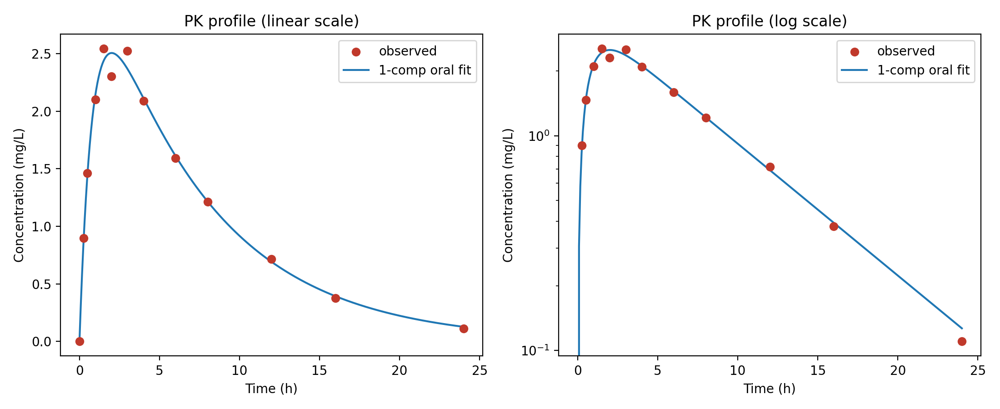
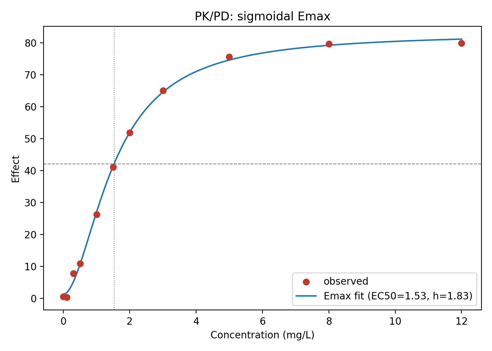

# Pharmacokinetics / PK-PD Toolkit

[](#)
[](#)
[](https://github.com/orlacchioresearch/pharmacokinetics-pkpd-toolkit/actions/workflows/tests.yml)

Non-compartmental analysis, one-compartment PK model fitting, and Emax PK/PD
modeling — implemented from scratch in NumPy and demonstrated on a synthetic
oral-dose dataset.

> **Scope.** All data is synthetic and clearly labelled as such. A portfolio /
> demonstration project, **not** a validated pharmacometrics package. For
> regulatory work use established tools (Phoenix WinNonlin, NONMEM, `nlmixr2`,
> `Pumas`), which add population modeling, BLQ handling, and richer diagnostics.

## What it does

**Non-compartmental analysis (`src/nca.py`)** Cmax/Tmax, AUC(last) and AUC(inf) by the linear trapezoidal rule with
log-linear extrapolation, terminal rate `lambda_z` (best-adjusted-R² regression
of the terminal phase) and half-life, AUMC/MRT, and apparent CL/F and Vz/F.

**Compartmental fitting (`src/compartmental.py`)** One-compartment **IV bolus** (exact log-linear fit) and **first-order oral
absorption** (the Bateman function, fitted by Levenberg-Marquardt). Reports
ka, ke, V/F, CL/F, and half-life.

**PK/PD (`src/emax.py`)** Simple and **sigmoidal (Hill) Emax** models of concentration vs. effect,
giving E0, Emax, EC50, and Hill slope.

The nonlinear fits use a small Levenberg-Marquardt routine in
`src/least_squares.py` — no SciPy dependency.

## Quickstart

```bash
python -m venv .venv && source .venv/bin/activate    # Windows: .venv\Scripts\activate
pip install -r requirements.txt

python data/generate_pk_data.py    # (re)build the synthetic datasets
python -m src.pkpd_analysis        # or: python src/pkpd_analysis.py
                                   # -> results/ + figures/

pip install -r requirements-dev.txt && python -m pytest -q   # run the tests
```

## Example results (bundled synthetic data)

A single-subject oral profile generated with **Dose = 100 mg, ka = 1.2/h,
ke = 0.15/h, V/F = 30 L** (so CL/F = 4.5 L/h), and an Emax PD relationship with
**EC50 = 1.5 mg/L, Hill = 1.8** — both recovered by the toolkit:

| Method | Key parameters |
| --- | --- |
| NCA | Cmax ≈ 2.5 mg/L, Tmax ≈ 1.5 h, AUC∞ ≈ 23.6 mg·h/L, t½ ≈ 4.5 h, CL/F ≈ 4.2 L/h |
| 1-compartment oral fit | ka ≈ 1.21/h, ke ≈ 0.14/h, V/F ≈ 30 L, CL/F ≈ 4.2 L/h (R² = 0.992) |
| Sigmoidal Emax | EC50 ≈ 1.53 mg/L, Hill ≈ 1.83, Emax ≈ 82 (R² = 0.999) |

## Figures

| Concentration–time (with 1-compartment fit) | Concentration–effect (Emax) |
| --- | --- |
|  |  |

## Repository structure

```text
├── README.md
├── requirements.txt / requirements-dev.txt   <- pinned dependencies
├── data/
│   ├── pk_concentration.csv                   <- oral concentration-time profile
│   ├── pd_effect.csv                          <- concentration-effect data
│   └── generate_pk_data.py                    <- deterministic data generator
├── src/
│   ├── nca.py                                 <- non-compartmental analysis
│   ├── compartmental.py                       <- 1-compartment IV / oral fits
│   ├── emax.py                                <- (sigmoidal) Emax PK/PD
│   ├── least_squares.py                       <- Levenberg-Marquardt (no SciPy)
│   └── pkpd_analysis.py                        <- end-to-end pipeline + main()
├── tests/                                     <- pytest unit + integration tests
├── figures/                                   <- generated plots
└── results/                                   <- generated parameter tables
```

## Notes & limitations

- NCA `lambda_z` is chosen by best-adjusted-R² over candidate terminal windows;
  a real analysis would also inspect the fit and apply BLQ/span rules.
- Fits are naive (ordinary) least squares on a single subject; population PK
  (mixed-effects) and weighting/BLQ handling are out of scope.
- For extravascular data F and V are confounded, so only the apparent V/F and
  CL/F are identifiable.

